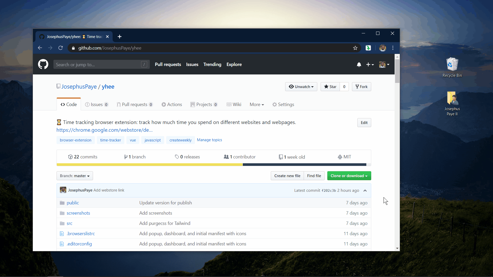

# Drag to download

👇🏾 A browser extension that allows you to drag a link from the browser unto your desktop to download.



## How to use

### Install and setup

- Install the extension: <https://chrome.google.com/webstore/detail/drag-to-download/nlbdfajoolkacbicncknldfoikncjdhb>.
- Visit each domain you want to enable the extension on, click the extension icon in the browser toolbar, then click **Enable Drag to download on this domain**.
- The browser will prompt you to give the extension permission to access the domain and reload the page. After you accept and reload, you should be able to drag and drop links to download.

### Remove from a domain

To remove the extension from a domain, visit the domain, click the extension icon, and then uncheck **Enable Drag to download on this domain**.

## Design

Uses a little-known drag-and-drop feature in Chrome as described in [this article](https://www.html5rocks.com/en/tutorials/casestudies/box_dnd_download/). Unfortunately this feature works only in Chrome (tested on Windows).

When a `dragstart` event is triggered on a link, we attach a `DownloadURL` property to the event's [`dataTransfer`](https://developer.mozilla.org/en-US/docs/Web/API/DragEvent/dataTransfer) property. This property's value is of the form `mime_type:file_name:absolute_url`:

- omit the mime type (for the browser to determine)
- compute the file name from the link's [`download`](https://developer.mozilla.org/en-US/docs/Web/HTML/Element/a#attr-download) property, `href`, or inner text
- compute the download URL by converting the link's `href` to an absolute URL

In code, this looks like the following (simplified):

```js
linkElement.addEventListener('dragstart', function(e) {
  const { file, url } = getDownloadUrlProperty(e.currentTarget);
  e.dataTransfer.setData('DownloadURL', `:${file}:${url}`);
});
```

## Contributing

See [contribution guide](CONTRIBUTING.md).

## Licence

[MIT](LICENCE)
